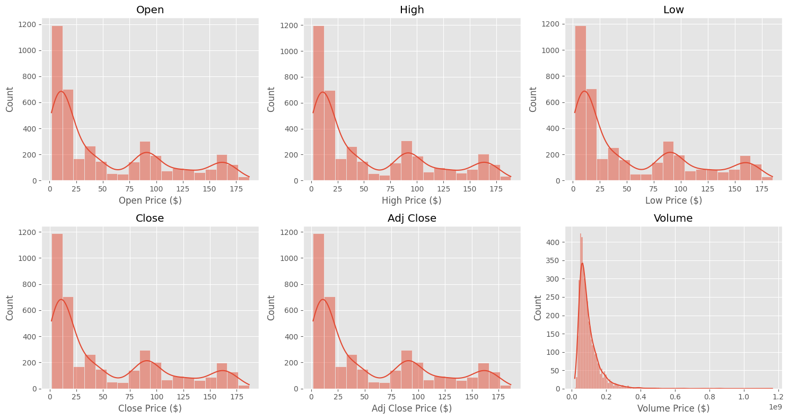
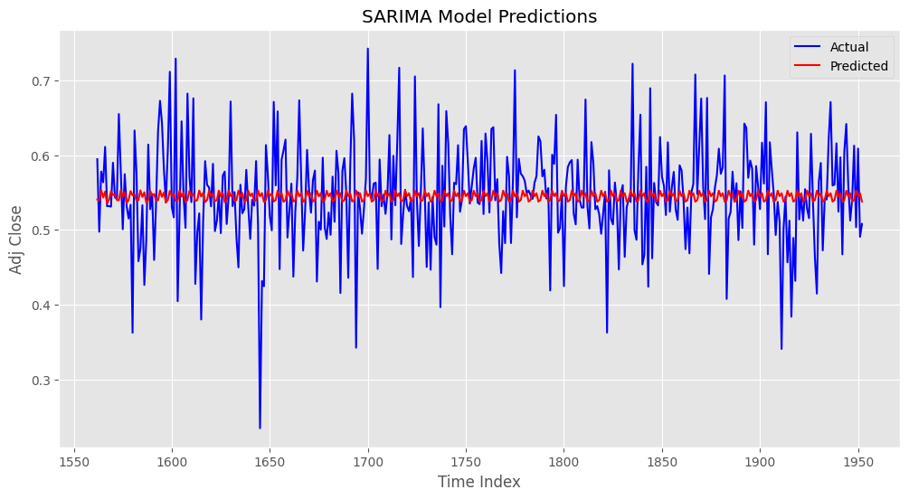

# Time series analysis and modelling - Stock Market Predictions

## **A. Business Overview**

• Stock price prediction is a challenging but
important task in the financial industry.  
• Traditional stock price prediction methods
have limitations.  

## **1.2 Problem Statement**
The  major challenge of this project is to accurately predict the future closing value of a given
stock across a given period of time in the future using LSTM.
Bulls and Bears seek to develop a reliable predictive model that helps investors make informed decisions about their Amazon stock holdings to maximize returns while managing risks.
### **1.3 General Objectives
To develop a robust stock price prediction model for Amazon stock market.

## **1.3.1 Specific Objectives 

### ** 1.3.2 Specific Objectives 
To build and implement different models for Amazon stock price prediction
To evaluate the performance and accuracy of the models using R2 Score, and RMSE.
To use the best performing model to forecast Amazon stock prices.
To create a user-friendly dashboard/application for stakeholders to access predictions.

## **B. Data Understanding and EDA**

During the exploration exercise, the amazon data was checked for the value counts of each column, to understand how various parameters in the columns were distributed The column definitions are displayed below. 

 #### **Data Features**   
The data has the following features:
- **Date**: date of the stock price observation.
- **Open price**: opening price of the stock on the given date.
- **High price**: highest price of the stock on the given date.
- **Low price**: lowest price of the stock on the given date.
- **Close price**: closing price of the stock on the given date.
- **Adjusted Close price**: closing price after adjustments for all applicable splits and dividend distributions
- **Volume**: number of shares of the stock traded on the given date.

**Shape**  
- It has 3,960 rows and 5 columns.

**Data Types**
- All the data is numerical as expected.

We will use this data analysis to extract meaningful insights that will guide our forecasting process.

### **1. Univariate Analysis**

#### **a. Distributon of The Columns using Histplots**

**Observations**
- The **`Open`, `High`, `Low`, `Close`, `Adj Close`** plots have similar distributions throughout the period under review (2008 to 2023).
    - They are trimodal (three peaks).
    - 0-25 dollars is the most frequent price.
- Volume seems to be heavily distributed around 100 million to 200 million.
- All are skewed to the right.
- No outliers are visible from these graphs.

## b. Time Series Plots for Open, High, Low, Close, and Adj Close Columns
The plots below visualize the historical price trends over the period under review.

**Observations**
- The data seems to have similar seasonality and trend characteristics. This will be confirmed in later sections.

## **C. Data Preparation**

### **1. Feature Engineering**

c. Lag Features for Adj Close price
Creating lag features will capture the historical behavior of the stock prices.
Lag features for the adjusted closing price have b

## **D. Time Series Modelling**

### **1. Baseline Model**

*   The project uses the SARIMA model as the baseline model.

### ** 1.1 SARIMA 1
The project uses the SARIMAX model as the baseline model.
Using the default values of the p,d,q for the baseline SARIMAX model. The valus of s is our seasonal period which is 5 days per week.
The SARIMAX result shows lower AIC of -3324.421 and BIC of -3297.723 indicating a good performance of the model.
The higher Log Likelihood of 1667.211 shows that the model has a good fit on the data used

### ** 1.2 SARIMA 2
Hyperparameter tuning using GridSearch CV is done to find the optimal values of hyperparameters (p,d,q) to be used SARIMA-2 modeling
The SARIMAX result shows lower AIC of -3523.004 and BIC of -3474.821 indicating a better performance of the model.
The higher Log Likelihood of 1770.502 shows that the model has a better fit on the data used as compared to the baseline model

#### **Prediction on the Training Data and Test data**

*   Perform a prediction on both the training dataset and Test dataset to see the the performance of the model on both the Training dataset and Test dataset.

### ** 1,3. FBProphet
Using FBProphet to forecast the data to show trends and future predictions

a. XGBOOST TO FIND IMPORTANT FEATURES
XGBoost's feature importance is used here to provide a ranking of features based on their influence in the model's predictions, aiding in understanding and optimizing feature selection.

### ** 1.4 . Simple  RNN

### ** 1.5 LSTM

### **2  Evaluation of Models**

# ** Conclusion

# ** Recommendition

