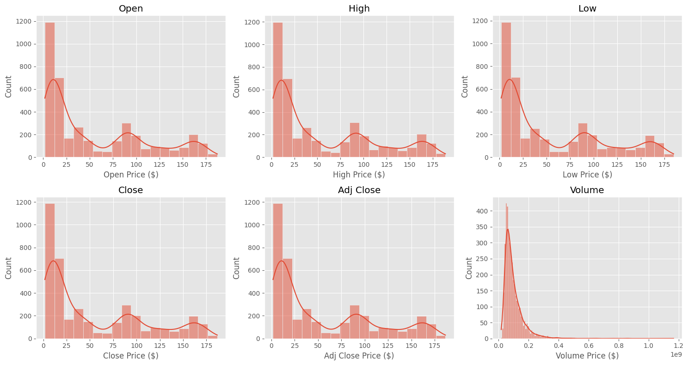
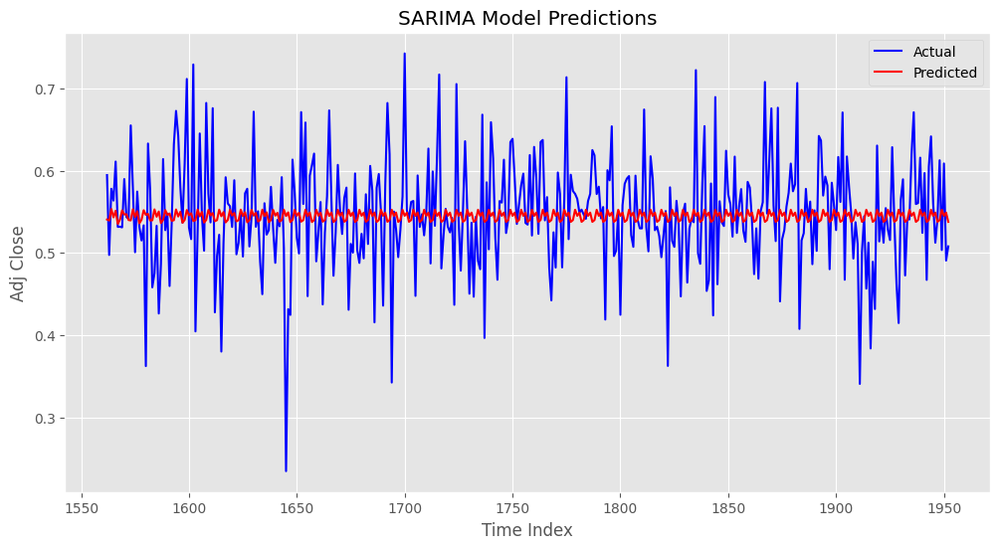

# AMAZON STOCK PRICE PREDICTIONS 

## **A. Business Overview**

• Stock price prediction, especially short-term, is difficult due
to market volatility. Investors require precise forecasts for
Amazon stock decisions.

• Creating dependable models for Amazon stock prediction
aids informed investor decisions. Developing accurate models
and their practical application is the challenge.

## **1.2 Problem Statement**
The primary challenge in predicting stock prices, especially in the short term, is the inherent volatility and unpredictability of the stock market. Investors and fund managers often face the problem of making optimal investment decisions. They need accurate forecasts to decide when to buy, sell, or hold Amazon's stock, but the accuracy of predictions can vary widely. Bulls and Bears seek to develop a reliable predictive model that helps investors make informed decisions about their Amazon stock holdings to maximize returns while managing risks. This problem encompasses the need for accurate predictions and the application of these predictions to real-world investment strategies.

### **1.3 General Objectives
To develop a robust stock price prediction model for Amazon stock market.

## **1.3.1 Specific Objectives 

### ** 1.3.2 Specific Objectives 
To build and implement different models for Amazon stock price prediction
To evaluate the performance and accuracy of the models using R2 Score, and RMSE.
To use the best performing model to forecast Amazon stock prices.
To create a user-friendly dashboard/application for stakeholders to access predictions.

## **B. Data Understanding and EDA**

During the exploration exercise, the amazon data was checked for the value counts of each column, to understand how various parameters in the columns were distributed The column definitions are displayed below. 

 #### **Data Features**   
The data has the following features:
- **Date**: date of the stock price observation.
- **Open price**: opening price of the stock on the given date.
- **High price**: highest price of the stock on the given date.
- **Low price**: lowest price of the stock on the given date.
- **Close price**: closing price of the stock on the given date.
- **Adjusted Close price**: closing price after adjustments for all applicable splits and dividend distributions
- **Volume**: number of shares of the stock traded on the given date.

**Shape**  
- It has 3,960 rows and 5 columns.

**Data Types**
- All the data is numerical as expected.

We will use this data analysis to extract meaningful insights that will guide our forecasting process.

### **1. Univariate Analysis**

#### **a. Distributon of The Columns using Histplots**

**Observations**
- The **`Open`, `High`, `Low`, `Close`, `Adj Close`** plots have similar distributions throughout the period under review (2008 to 2023).
    - They are trimodal (three peaks).
    - 0-25 dollars is the most frequent price.
- Volume seems to be heavily distributed around 100 million to 200 million.
- All are skewed to the right.
- No outliers are visible from these graphs.

## b. Time Series Plots for Open, High, Low, Close, and Adj Close Columns
The plots below visualize the historical price trends over the period under review.

**Observations**
- The data seems to have similar seasonality and trend characteristics. This will be confirmed in later sections.

## **C. Data Preparation**

### **1. Feature Engineering**

c. Lag Features for Adj Close price
Creating lag features will capture the historical behavior of the stock prices.
Lag features for the adjusted closing price have b

## **D. Time Series Modelling**

### **1. Baseline Model**

*   The project uses the SARIMA model as the baseline model.

### ** 1.1 SARIMA 1
The project uses the SARIMAX model as the baseline model.
Using the default values of the p,d,q for the baseline SARIMAX model. The valus of s is our seasonal period which is 5 days per week.
The SARIMAX result shows lower AIC of -3324.421 and BIC of -3297.723 indicating a good performance of the model.
The higher Log Likelihood of 1667.211 shows that the model has a good fit on the data used

### ** 1.2 SARIMA 2
Hyperparameter tuning using GridSearch CV is done to find the optimal values of hyperparameters (p,d,q) to be used SARIMA-2 modeling
The SARIMAX result shows lower AIC of -3523.004 and BIC of -3474.821 indicating a better performance of the model.
The higher Log Likelihood of 1770.502 shows that the model has a better fit on the data used as compared to the baseline model

#### **Prediction on the Training Data and Test data**

*   Perform a prediction on both the training dataset and Test dataset to see the the performance of the model on both the Training dataset and Test dataset.

### ** 1,3. FBProphet
Using FBProphet to forecast the data to show trends and future predictions

a. XGBOOST TO FIND IMPORTANT FEATURES
XGBoost's feature importance is used here to provide a ranking of features based on their influence in the model's predictions, aiding in understanding and optimizing feature selection.

### ** 1.4 . Simple  RNN

### ** 1.5 LSTM

### **2  Evaluation of Models**

	Model	MAE	MSE	RMSE	MAPE	R2-Score
0	Baseline Model-SARIMA-1	0.0506	0.0047	0.0683	9.6815	0.0016
1	SARIMA-2	0.0506	0.0047	0.0683	9.6815	0.0025
2	FB Prophet	0.0551	0.0058	0.076	10.5142	-0.0138
3	Simple RNN	0.0779	0.0107	0.1033	14.778	-0.0471
4	LSTM-Original Features	0.0779	0.0133	0.1153	23.1175	-0.0025
5	LSTM-Important Features	0.0779	0.0103	0.1013	14.9543	-0.0036

SARIMA-2 appears to be the best-performing model among the options listed. It has the highest R2-Score of 0.0025, and the lowest MAE, MSE, and RMSE, indicating that it provides the most accurate predictions with relatively low error rates. The MAPE is also below 10%, suggesting that, on average, its predictions are within 10% of the actual Amazon stock prices.
FB Prophet, while having a low MAE, MSE, and RMSE but the values are higher as compared to SARIMA-2. It also has higher MAPE which is above 10%, and a negative value of R-2 Score. This indicates that it might not be as accurate as SARIMA-2 in predicting Amazon stock prices.
The Simple RNN model performs lower than FB Prophet in terms of MAE, MSE, and RMSE, it is not as accurate as SARIMA-2 and FB Prophet, as it has higher error rates.
The LSTM with original features model with original features has lowest performance as compared to SARIMA-2, FB Prophet and Simple RNN, with slightly higher MAE, MAPE and RMSE. It has the highest MAPE of 23.1175%.
The LSTM model with important features has a better performance to the LSTM with original features and Simple RNN. However, it still does not perform as well as SARIMA-2 and FB Prophet in terms of accuracy.
In summary, the SARIMA-2 model outperforms the other models in predicting Amazon stock prices, as it has the lowest MAE, MSE, and RMSE along with a reasonably low MAPE. It is also recorded the highest positive R-Squared Score value. The other models have higher errors and are less accurate in comparison.

# ** Conclusion
From our time series analysis SARIMA-2 model performed the best with MAE score of 0.0506, MSE score of 0.0047 RMSE score of 0.0683 and MAPE score of 9.6815 compared to the other models we used which were:
1. FB Prophet
2. Simple RNN
3. LSTM-original features
4. LSTM-Important features

SARIMA-2 model performed well for short term predictions however long term predictions brought wide variations.

The top 8 features which highly influenced the price predictions in the amazon stock market are:
Close price,
Highest price,
Returns,
Rolling_Std,
Volume,
Open price,
Rate Of Change,
Relative Strength Index.

# ** Recommendition
1. Investors and financial institutions can use the model for short term prediction of Amazon stock prices to determine the general trend of the amazon prices. However other factor such as fundamental analysis need to be consider before making the final decision.

2. Our deployment model can also be improved and used for predicting other stock markets other than Amazon stocks only.

3. For better performance of the LSTM model, more data is required for analysis. More data will enhance the model’s ability to recognize patterns and trends.

4. Carry out sentimental analysis alongside the model to factor in the impact of news and public sentiment on stock prices changes. This analysis will provide valuable contextual information.

5. Experiment with different train-test split ratios to evaluate how the model’s performance is affected by the division of data. This will help determine the optimal balance between the training and testing data that gives better performance of the model.

6. Coming up with a model that can predict other stock markets, not just Amazon. This will provide valuable insights from diverse stock markets  to the investors.

### ** Limitations
1. Time series is an intensive machine learning models and hence it required more time for us to come up with optimum parameter and hyper-parameters for the model to perform much better which was a great constrain.
2. Stock prices are influenced by various external factors, including unforeseen events like wars and diseases/pandemics, which are difficult to predict and can significantly impact market values.

